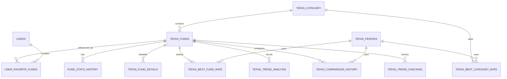
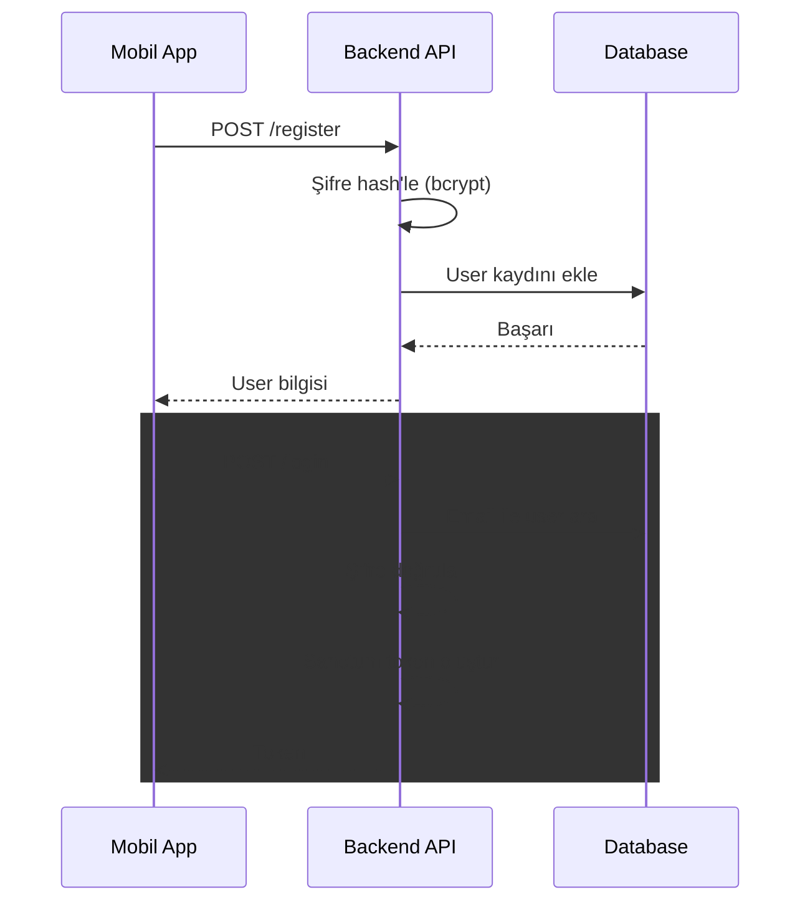
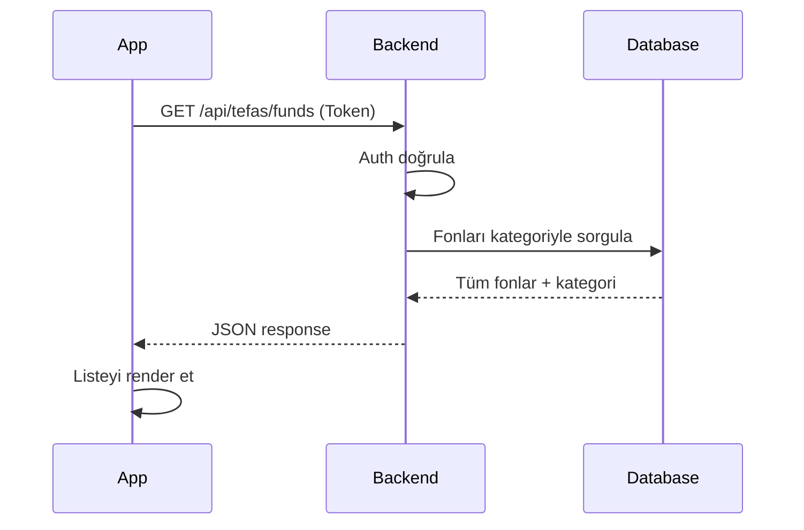
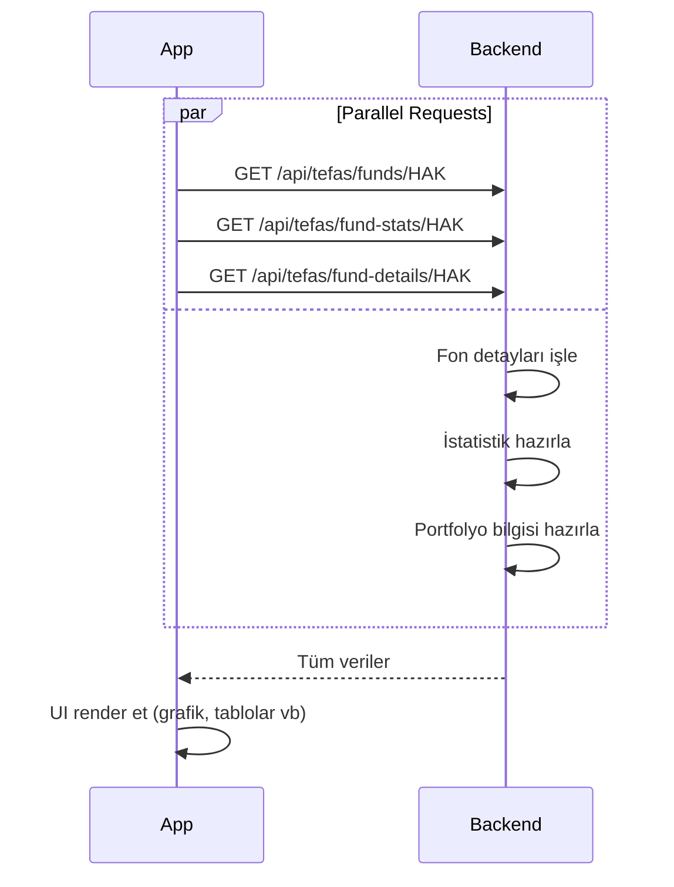
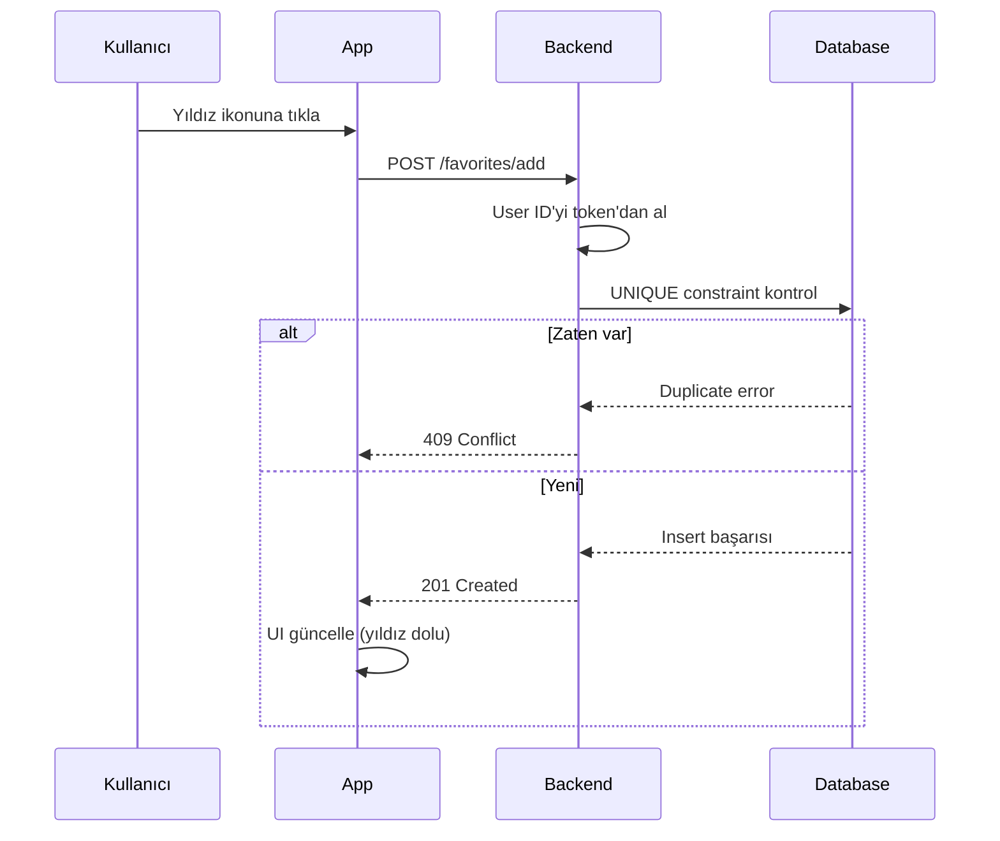

# 📊 TEFAS Analytics Backend

TEFAS için modern REST API. Mobil ve web uygulamalarınız için fon verilerini, istatistiklerini, performans karşılaştırmalarını ve favori yönetimini sunan eksiksiz bir backend sistemi.

---

## 📋 İçindekiler

- [✨ Özellikler](#-özellikler)
- [🛠️ Teknoloji Stack](#️-teknoloji-stack)
- [🚀 Kurulum](#-kurulum)
- [📚 API Dokümantasyonu](#-api-dokümantasyonu)
- [🗄️ Database Yapısı](#️-database-yapısı)
- [🔄 İş Akışı](#-iş-akışı)
- [🎯 Fiyat ve Dönemler](#-fiyat-ve-dönemler)
- [🚀 Deployment](#-deployment)
- [🧪 Testing & Development](#-testing--development)
- [🤝 Katkıda Bulunma](#-katkıda-bulunma)

---

## ✨ Özellikler

### 🎯 Temel Özellikler

- **🔐 Güvenli Kimlik Doğrulama** - Laravel Sanctum token-based authentication
- **📊 Kapsamlı Fon Verileri** - 14+ API endpoint ile fon bilgileri, istatistikler, karşılaştırmalar
- **❤️ Favori Yönetimi** - Kullanıcılar favori fon listesi oluşturup yönetebilir
- **⚡ Optimize Sorgular** - Eloquent ORM ile hızlı database işlemleri
- **📱 Mobil Odaklı** - React Native uygulamalar için tasarlanmış
- **🌐 Unicode Türkçe Desteği** - Tüm API yanıtları ve veri Türkçe karakter uyumlu

### 🌐 Platform Desteği

- **Web Browser** - RESTful API üzerinden erişim
- **Mobile App** - React Native ile cross-platform (geliştirme aşamasında)

### 🔧 Teknik Özellikler

- **RESTful API** mimarisi
- **Composite Primary Keys** - İstatistik ve portfolyo geçmişi yönetimi (code+date)
- **10 Model** - User, Fund, Category, Period, Stats, Details vb
- **8 Controller** - Modular ve maintainable kod yapısı
- **Soft Delete Ready** - Model yapısı soft delete'e hazır
- **Laravel Sanctum** - Stateless token authentication

---

## 🛠️ Teknoloji Stack

| Bileşen | Teknoloji | Versiyon |
|---------|-----------|---------|
| **Framework** | Laravel | 12.0 |
| **Language** | PHP | 8.2+ |
| **Database** | SQLite / MySQL / PostgreSQL | Latest |
| **Authentication** | Laravel Sanctum | 4.0 |
| **Frontend Build** | Vite | 7.0.7 |
| **CSS Framework** | Tailwind CSS | 4.0 |
| **Template Engine** | Blade | Built-in |
| **HTTP Client** | Axios | 1.11 |
| **Testing** | PHPUnit | 11.5.3 |
| **Node.js** | npm | 18+ |

---

## 🚀 Kurulum

### 📋 Ön Gereksinimler

```bash
# PHP 8.2+ ve Composer gerekli
php --version
composer --version

# Node.js 18+ ve npm gerekli
node --version
npm --version
```

### 1️⃣ Repository Klonlama

```bash
git clone https://github.com/yourusername/tefas-backend.git
cd tefas-backend
```

### 2️⃣ Bağımlılıkları Yükleme

```bash
# PHP dependencies
composer install

# Node.js dependencies
npm install
```

### 3️⃣ Environment Yapılandırması

```bash
# .env dosyası oluştur
cp .env.example .env

# Application key oluştur (gerekli)
php artisan key:generate
```

**.env dosyasında database bağlantısını ayarla** (SQLite, MySQL veya PostgreSQL seç)

### 4️⃣ Database Kurulumu

```bash
# Tabloları oluştur
php artisan migrate

# (Opsiyonel) Test verisi ekle
php artisan db:seed
```

### 5️⃣ Assets Build

```bash
# Production build
npm run build

# Veya development mode
npm run dev
```

### 6️⃣ Servisleri Başlat

**Tüm servisleri birlikte başlatmak için:**

```bash
composer run dev
```

Bu şu servisleri başlatır:
- Laravel Server (port 8000)
- Queue Listener
- Pail Log Viewer
- Vite Assets (Hot Reload)

**veya her servisi ayrı ayrı:**

```bash
# Terminal 1
php artisan serve

# Terminal 2
npm run dev

# Terminal 3 (opsiyonel)
php artisan pail --timeout=0

# Terminal 4 (opsiyonel)
php artisan queue:listen
```

✅ **Başarılı!** API'ye erişim: `http://localhost:8000/api`

---

## 📚 API Dokümantasyonu

### 🔑 Kimlik Doğrulama (Public)

#### `POST /api/register`

Yeni kullanıcı kaydı oluştur.

```http
POST /api/register HTTP/1.1
Host: localhost:8000
Content-Type: application/json

{
  "name": "Ahmet Yılmaz",
  "email": "ahmet@example.com",
  "password": "password123",
  "password_confirmation": "password123"
}
```

**Response (201):**
```json
{
  "success": true,
  "message": "Kayıt başarılı!",
  "user": {
    "id": 1,
    "name": "Ahmet Yılmaz",
    "email": "ahmet@example.com",
    "created_at": "2026-03-28T10:30:00Z"
  }
}
```

---

#### `POST /api/login`

Giriş yap ve API token al.

```http
POST /api/login HTTP/1.1
Host: localhost:8000
Content-Type: application/json

{
  "email": "ahmet@example.com",
  "password": "password123"
}
```

**Response (200):**
```json
{
  "success": true,
  "message": "Giriş başarılı!",
  "user": {
    "id": 1,
    "name": "Ahmet Yılmaz",
    "email": "ahmet@example.com"
  },
  "token": "1|SomeVeryLongTokenString..."
}
```

Token'ı sakla! Tüm protected endpoint'ler için gerekli:
```
Authorization: Bearer YOUR_TOKEN
```

---

### 🔒 Korumalı Endpoints

#### `GET /api/user`

Authenticated kullanıcı bilgisi getir.

```http
GET /api/user HTTP/1.1
Authorization: Bearer YOUR_TOKEN
```

---

#### `POST /api/logout`

Çıkış (token'ı sil).

```http
POST /api/logout HTTP/1.1
Authorization: Bearer YOUR_TOKEN
```

---

### 📊 Fon İşlemleri

#### `GET /api/tefas/funds`

Tüm fonları kategoriyle birlikte listele.

```http
GET /api/tefas/funds HTTP/1.1
Authorization: Bearer YOUR_TOKEN
```

**Response:**
```json
{
  "success": true,
  "data": [
    {
      "code": "HAK",
      "name": "Halkbank Yatırım Fonu",
      "category_name": "Hisse Senedi Fonu"
    },
    {
      "code": "YAT",
      "name": "Yapı Kredi Yatırım Fonu",
      "category_name": "Sabit Getirili Fonu"
    }
  ]
}
```

---

#### `GET /api/tefas/funds/{code}`

Spesifik fon tüm detayları (komisyon, risk, varlık dağılımı).

```http
GET /api/tefas/funds/HAK HTTP/1.1
Authorization: Bearer YOUR_TOKEN
```

**Response:**
```json
{
  "success": true,
  "data": {
    "code": "HAK",
    "name": "Halkbank Yatırım Fonu",
    "category_id": 2,
    "isin_code": "XGNSHAKYKT",
    "entry_commission": 0.5,
    "exit_commission": 0.25,
    "risk_value": 6,
    "fon_varlık_dagılım_list": [
      "Hisse Senedi",
      "Tahvil",
      "Para Piyasası"
    ],
    "fon_varlık_dagılım_degerler": [0.65, 0.30, 0.05]
  }
}
```

---

### 📈 İstatistikler

#### `GET /api/tefas/fund-stats/{code}`

Fon son istatistikleri (fiyat, getiri, yatırımcı sayısı).

```http
GET /api/tefas/fund-stats/HAK HTTP/1.1
Authorization: Bearer YOUR_TOKEN
```

**Response:**
```json
{
  "success": true,
  "data": {
    "code": "HAK",
    "last_price": 155.75,
    "daily_return": 0.45,
    "return_1m": 2.35,
    "return_3m": 5.12,
    "return_6m": 8.67,
    "return_1y": 15.45,
    "return_2y": 28.90,
    "investor_count": 45230,
    "market_share": 3.25,
    "category_rank": 2
  }
}
```

---

#### `GET /api/tefas/best-category-rates/period/{periodId}`

Dönem bazında tüm kategorilerin verimlilik oranları.

```http
GET /api/tefas/best-category-rates/period/12 HTTP/1.1
Authorization: Bearer YOUR_TOKEN
```

**Response:**
```json
{
  "success": true,
  "fetched_at": "2026-03-28",
  "data": [
    {
      "category": {
        "id": 1,
        "name": "Hisse Senedi Fonu"
      },
      "rate": 18.50
    },
    {
      "category": {
        "id": 2,
        "name": "Sabit Getirili Fonu"
      },
      "rate": 12.35
    }
  ]
}
```

---

#### `GET /api/tefas/best-fund-rates/category/{categoryId}/period/{periodId}`

Kategori ve dönem bazında ilk 9 fon.

```http
GET /api/tefas/best-fund-rates/category/1/period/12 HTTP/1.1
Authorization: Bearer YOUR_TOKEN
```

**Response:**
```json
{
  "success": true,
  "data": [
    {
      "rank": 1,
      "fund_code": "HAK",
      "rate": 22.50
    },
    {
      "rank": 2,
      "fund_code": "YAT",
      "rate": 21.80
    }
  ]
}
```

---

### 📋 Portfolyo Detayları

#### `GET /api/tefas/fund-details?date=2026-03-28`

Tüm fonların varlık dağılımı.

```http
GET /api/tefas/fund-details HTTP/1.1
Authorization: Bearer YOUR_TOKEN
```

---

#### `GET /api/tefas/fund-details/{code}?date=2026-03-28`

Spesifik fon portfolyo dağılımı (50+ varlık tipi).

```http
GET /api/tefas/fund-details/HAK HTTP/1.1
Authorization: Bearer YOUR_TOKEN
```

---

### 🔄 Karşılaştırma

#### `GET /api/tefas/comparison/{code}/period/{periodId}`

Fon karşılaştırma verileri (dönem bazlı).

```http
GET /api/tefas/comparison/HAK/period/12 HTTP/1.1
Authorization: Bearer YOUR_TOKEN
```

---

### 📈 Trend Analizi

#### `GET /api/tefas/trend-analysis`

Tüm fonlar için en güncel trend analiz verilerini (seri yükseliş/düşüş günleri, değişim yüzdesi) getirir.

```http
GET /api/tefas/trend-analysis HTTP/1.1
Authorization: Bearer YOUR_TOKEN
```

**Response:**
```json
{
  "success": true,
  "analysis_date": "2026-05-03",
  "total_funds": 150,
  "data": [
    {
      "fund_code": "HAK",
      "fund_name": "Halkbank Yatırım Fonu",
      "category_id": 2,
      "category_name": "Hisse Senedi Fonu",
      "streak_days": 3,
      "change_percent": 1.25,
      "last_price": 155.75
    }
  ]
}
```

---

#### `GET /api/tefas/trend-checks`

Son 30 gün içerisindeki genel yükseliş ve düşüş günü sayısını getirir.

```http
GET /api/tefas/trend-checks HTTP/1.1
Authorization: Bearer YOUR_TOKEN
```

**Response:**
```json
{
  "success": true,
  "analysis_date": "2026-05-03",
  "total_funds": 150,
  "data": [
    {
      "fund_code": "HAK",
      "fund_name": "Halkbank Yatırım Fonu",
      "category_name": "Hisse Senedi Fonu",
      "up_days_count": 18,
      "down_days_count": 12,
      "total_return": 5.45
    }
  ]
}
```

---

### ❤️ Favori Yönetimi

#### `GET /api/favorites`

Kullanıcının favori fonlarını listele.

```http
GET /api/favorites HTTP/1.1
Authorization: Bearer YOUR_TOKEN
```

**Response:**
```json
{
  "success": true,
  "data": [
    {
      "fund_code": "HAK",
      "name": "Halkbank Yatırım Fonu",
      "category_name": "Hisse Senedi Fonu"
    }
  ],
  "count": 1
}
```

---

#### `POST /api/favorites/add`

Fonu favorilere ekle.

```http
POST /api/favorites/add HTTP/1.1
Authorization: Bearer YOUR_TOKEN
Content-Type: application/json

{
  "fund_code": "HAK"
}
```

**Response (201):**
```json
{
  "success": true,
  "message": "Fon favorilere eklendi"
}
```

---

#### `POST /api/favorites/check`

Hangi fonların favori olduğunu kontrol et.

```http
POST /api/favorites/check HTTP/1.1
Authorization: Bearer YOUR_TOKEN
Content-Type: application/json

{
  "fund_codes": ["HAK", "YAT", "TBF"]
}
```

**Response:**
```json
{
  "success": true,
  "data": {
    "HAK": true,
    "YAT": false,
    "TBF": true
  }
}
```

---

#### `DELETE /api/favorites/{fundCode}`

Fonu favorilerden çıkar.

```http
DELETE /api/favorites/HAK HTTP/1.1
Authorization: Bearer YOUR_TOKEN
```

**Response:**
```json
{
  "success": true,
  "message": "Fon favorilerden çıkarıldı"
}
```

---

## 🖥️ Frontend Sayfaları (Blade Views)

Proje, sadece bir REST API sunmakla kalmaz; Vite ve TailwindCSS ile derlenmiş Blade şablonlarını içeren bir frontend katmanına da sahiptir. Web arayüzündeki sayfaların işlevleri aşağıdadır:

### 🔐 Kimlik Doğrulama
- **`/login` (Giriş Sayfası):** Kullanıcıların e-posta ve şifreleriyle oturum açtıkları, güvenli giriş ekranı.
- **`/register` (Kayıt Sayfası):** Yeni kullanıcıların sisteme kayıt olmak için ad, e-posta ve şifre bilgilerini girdikleri form sayfası.

### 📱 Ana Uygulama (App)
- **`/` (Analiz & Dashboard):** Sisteme giriş yapıldığında karşılaşılan ana gösterge paneli. Piyasaya genel bakış, trend olan fonlar ve hızlı özet verilerini tek ekranda sunar.
- **`/funds` (Tüm Fonlar):** Sistemdeki (TEFAS'taki) tüm fonların listelendiği ana katalog. Kategorilere göre filtreleme ve isim/koda göre arama özelliklerini barındırır.
- **`/funds/{code}` (Fon Detay Sayfası):** Belirli bir fon seçildiğinde açılan, fonun; fiyat hareketlerini, komisyon oranlarını, güncel risk değerini ve 50'den fazla varlık tipiyle portföy dağılım grafiğini gösteren kapsamlı analiz sayfası.
- **`/top-earners` (En Çok Kazandıranlar):** Çeşitli periyotlara (1 ay, 3 ay, 1 yıl vb.) göre kategorisinin şampiyonu olmuş, en yüksek verimi sağlayan fonların sıralandığı liderlik tablosu (leaderboard).
- **`/history` (Tarihsel Veriler & Karşılaştırma):** İki veya daha fazla fonun geçmiş performanslarının yan yana kıyaslandığı, tarihsel veriler üzerinden derinlemesine analizlerin yapıldığı sayfa.
- **`/profile` (Kullanıcı Profili):** Kullanıcının hesap ayarlarını gördüğü, favorilediği fonların listesine eriştiği ve kendi sepetini yönettiği kişisel alan.

---

## 🗄️ Database Yapısı

### Veritabanı Tabloları (6 Migration'ı Mevcut)

| Tablo | Durum | Açıklama |
|-------|-------|----------|
| `users` | ✅ Migration var | Kullanıcı hesapları |
| `user_favorite_funds` | ✅ Migration var | Favori fon ilişkisi |
| `personal_access_tokens` | ✅ Migration var | Sanctum API tokens |
| `cache` | ✅ Migration var | Cache tablosu |
| `sessions` | ✅ Migration var | Session verileri |
| `password_reset_tokens` | ✅ Migration var | Password reset tokens |

### Gerekli Tablolar (Migration Yazılması Gerekli)

| Tablo | Açıklama | Durum |
|-------|----------|-------|
| `tefas_category` | Fon kategorileri (Hisse, Sabit, vb.) | ❌ Gerekli |
| `tefas_periods` | Dönemler (1m, 3m, 6m, 1y, 2y) | ❌ Gerekli |
| `tefas_funds` | Fon ana bilgileri | ❌ Gerekli |
| `fund_stats_history` | İstatistik geçmişi (daily) | ❌ Gerekli |
| `tefas_fund_details` | Portfolyo dağılımı (50+ alan) | ❌ Gerekli |
| `tefas_best_category_rate` | Kategori verimlilik oranları | ❌ Gerekli |
| `tefas_best_fund_rate` | Top 9 fon | ❌ Gerekli |
| `tefas_comparison_history` | Karşılaştırma verileri (JSON) | ❌ Gerekli |
| `tefas_trend_analysis` | Anlık trend analiz verileri | ❌ Gerekli |
| `tefas_trend_checking` | Son 30 günlük trend kontrolü | ❌ Gerekli |

---

### Tablo Şemaları

#### `users`

| Alan | Tip | Açıklama |
|------|-----|----------|
| `id` | BIGINT | Primary Key |
| `name` | VARCHAR | Kullanıcı adı |
| `email` | VARCHAR | Benzersiz e-posta |
| `password` | VARCHAR | Hash'lenmiş şifre |
| `created_at` | TIMESTAMP | Oluşturulma tarihi |
| `updated_at` | TIMESTAMP | Güncellenme tarihi |

---

#### `user_favorite_funds`

| Alan | Tip | İlişki | Açıklama |
|------|-----|--------|----------|
| `id` | BIGINT | PK | Primary Key |
| `user_id` | BIGINT | FK | users.id (CASCADE) |
| `fund_code` | VARCHAR | FK | tefas_funds.code |
| `created_at` | TIMESTAMP | - | Eklenme tarihi |

**Constraints**: UNIQUE(user_id, fund_code)

---

#### `tefas_funds` (Migration Gerekli)

| Alan | Tip | Açıklama |
|------|-----|----------|
| `code` | VARCHAR | Primary Key (HAK, YAT, vb) |
| `name` | VARCHAR | Fon adı |
| `category_id` | BIGINT | FK → tefas_category |
| `isin_code` | VARCHAR | ISIN kodu |
| `entry_commission` | DECIMAL | Giriş komisyonu % |
| `exit_commission` | DECIMAL | Çıkış komisyonu % |
| `risk_value` | TINYINT | Risk puanı (1-10) |

---

#### `fund_stats_history` (Migration Gerekli)

**Composite Primary Key**: (code, created_at)

| Alan | Açıklama |
|------|----------|
| `code` | Fon kodu |
| `created_at` | Tarih |
| `last_price` | Son fiyat |
| `daily_return` | Günlük getiri % |
| `return_1m` ... `return_2y` | Dönem getirileri |
| `investor_count` | Yatırımcı sayısı |
| `market_share` | Pazar payı % |

---

#### `tefas_fund_details` (Migration Gerekli)

**Composite Primary Key**: (code, tarih)

50+ Varlık Tipi: BB, BPP, BYF, D, DB, DT, DÖT, EUT, FB, FKB, GAS, GSYKB, GSYY, HAT, HDF, HST, İKB... ve daha fazla

---

#### Diğer Tablolar (Migration Gerekli)

**tefas_category:**
- `id`: BIGINT (PK)
- `name`: VARCHAR (Hisse Senedi, Sabit Getirili, vb)

**tefas_periods:**
- `id`: INT (PK) - 1, 3, 6, 12, 24
- `period_name`: VARCHAR (1 Aylık, 3 Aylık, vb)

**tefas_best_category_rate:**
- `id`: BIGINT (PK)
- `category_id`: BIGINT (FK)
- `period_id`: INT (FK)
- `getiri`: DECIMAL
- `fetched_at`: DATE

**tefas_best_fund_rate:**
- `id`: BIGINT (PK)
- `category_id`: BIGINT (FK)
- `period_id`: INT (FK)
- `fund_code`: VARCHAR (FK)
- `rank`: TINYINT (1-9)
- `getiri`: DECIMAL
- `fetched_at`: DATE

**tefas_comparison_history:**
- `id`: BIGINT (PK)
- `fund_code`: VARCHAR (FK)
- `period_id`: INT (FK)
- `comparison_names`: JSON
- `comparison_values`: JSON
- `fetched_at`: DATE

**tefas_trend_analysis:**
- `id`: BIGINT (PK)
- `fund_code`: VARCHAR (FK)
- `up_streak`: INT
- `down_streak`: INT
- `change_percent`: DECIMAL
- `last_price`: DECIMAL
- `analysis_date`: DATE

**tefas_trend_checking:**
- `id`: BIGINT (PK)
- `fund_code`: VARCHAR (FK)
- `up_days_count`: INT
- `down_days_count`: INT
- `total_return`: DECIMAL
- `analysis_date`: DATE

---

### Entity Relationship Diagram



---

## 🔄 İş Akışı

### 1. Kullanıcı Kaydı & Girişi



---

### 2. Fon Listesi Görüntüleme



---

### 3. Fon Detay & İstatistik



---

### 4. Favori Yönetimi



---

## 🎯 Fiyat ve Dönemler

### Dönemler

| ID | Dönem | Alan (database) |
|----|-------|-----------------|
| 1 | 1 Aylık | `return_1m` |
| 3 | 3 Aylık | `return_3m` |
| 6 | 6 Aylık | `return_6m` |
| 12 | 1 Yıllık | `return_1y` |
| 24 | 2 Yıllık | `return_2y` |

### Fon Kategorileri

- Hisse Senedi Fonu
- Sabit Getirili Fonu
- Para Piyasası Fonu
- Karma Fonu
- Fon Sepeti
- Emtia Fonu (Altın, vb)

### Portfolio Varlık Tipleri (50+)

- **BB** - Borsa Bileşeni
- **BPP** - Bağlı Portföy Payı
- **BYF** - Borsa Yatırım Fonu
- **D** - Döviz
- **DB** - Dışarıdaki Borsa
- **DT** - Döviz Tahvili
- **DÖT** - Döviz Opsiyon Tahvili
- **EUT** - Euro Tahvili
- **FB** - Foreign Bonds
- ... (40+ daha)

---

## 🚀 Deployment

### Production Environment Ayarları

**.env dosyasında aşağıdaki bölümler ayarlanmalı:**

- `APP_ENV=production`
- `APP_DEBUG=false`
- `DB_CONNECTION` ve host/port/database/username/password
- `SANCTUM_STATELESS_DOMAIN`
- Cache, session, queue drivers (opsiyonel: redis)

### Build & Deploy Komutları

```bash
# Production build
composer install --optimize-autoloader --no-dev
npm run build

# Cache optimize
php artisan config:cache
php artisan route:cache
php artisan view:cache

# Database migrate
php artisan migrate --force

# Permissions
chmod -R 755 storage bootstrap/cache
```

### Nginx Konfigürasyonu Örneği

```nginx
server {
    listen 80;
    server_name yourdomain.com;
    root /path/to/tefas-backend/public;

    add_header X-Frame-Options "SAMEORIGIN";
    add_header X-Content-Type-Options "nosniff";

    index index.php;

    location / {
        try_files $uri $uri/ /index.php?$query_string;
    }

    location ~ \.php$ {
        fastcgi_pass unix:/var/run/php/php8.2-fpm.sock;
        fastcgi_param SCRIPT_FILENAME $realpath_root$fastcgi_script_name;
        include fastcgi_params;
    }

    location ~ /\.(?!well-known).* {
        deny all;
    }
}
```

---

## 🧪 Testing & Development

### Testler Çalıştırma

```bash
# Tüm testler
php artisan test

# Spesifik test dosyası
php artisan test tests/Feature/UserTest.php

# Coverage raporu
php artisan test --coverage
```

### Development Tools

```bash
# Interactive shell
php artisan tinker
>>> User::count()
>>> TefasFund::first()

# Route listeleme
php artisan route:list

# Real-time logs
php artisan pail --timeout=0
```

---

## 🤝 Katkıda Bulunma

### Development Setup

```bash
# Fork ve clone
git clone https://github.com/ahmetymtkn/tefas-backend.git

# Feature branch
git checkout -b feature/amazing-feature

# Commit
git commit -m "feat: Add amazing feature"

# Push
git push origin feature/amazing-feature

# Pull Request aç
```

### Coding Standards

- ✅ **PSR-12** - PHP formatting
- ✅ **PHPUnit** - Tüm testler pass etmeli
- ✅ **Database** - Yeni tablolar için migration yazılmalı
- ✅ **Documentation** - Yeni endpoint'ler README'ye yazılmalı
- ✅ **Validation** - Input validation zorunlu

---

### Issue Reporting

```markdown
**Sorunun Açıklaması**
Ne yanlış gidiyor? Açık ve net başlatın.

**Nasıl Tekrar Edilir**
1. API endpoint'ini çağır
2. Verisi gönder
3. Hatayı gör

**Beklenen Davranış**
Ne olması gerekiyordu?

**Gerçek Davranış**
Ne oldu?

**Environment**
- Laravel Version: 12.0
- PHP Version: 8.2.x
- Database: MySQL/SQLite
```

---

## 📄 Lisans

MIT Lisansı

---


⭐ **Projeyi beğendiyseniz star vermeyi unutmayın!**

🐛 **Bug bulursanız issue açınız.**

🚀 **Katkıda bulunmak için PR gönderin.**

---

**Last Updated**: 28 Mart 2026
